```mermaid
erDiagram
    AUTH.USERS {
        uuid id PK
        string email
        string phone
    }

    PROFILES {
        uuid id PK "sin FK a auth.users: hay alumnos sin cuenta (alta_alumno)"
        string nombre_completo
        date fecha_nacimiento
        numeric peso_kg
        numeric altura_cm
        string telefono
        string contacto_emergencia
        string datos_salud
        uuid maestro_id FK "árbol de linaje (ascendente); asignado/cambiado solo vía Service Role"
        bool grados_verificados
        bool es_profesor "faceta profesor (alumno = perfil base)"
        bool es_maestro "faceta maestro (solo-sistema, concede servicios internos)"
        string dni UK "nullable en BD; obligatorio a nivel app"
        genero genero "masculino | femenino | otro"
        grado grado_actual "enum unificado Gup+Dan (dan_1..dan_9)"
        timestamptz creado_en
    }

    LOCACIONES {
        uuid id PK
        string nombre
        string direccion "NOT NULL (obligatoria)"
        numeric valor_alquiler "NOT NULL, check >= 0 (valor PACTO del contrato, SRS §3.3)"
        uuid creado_por FK "RLS: dueño gestiona; superiores auditan"
        timestamptz creado_en
    }

    PAGOS_ALQUILER {
        uuid id PK
        uuid locacion_id FK "on delete restrict"
        numeric monto
        string periodo "ej '2026-09'"
        date fecha_pago
        string comprobante_url "path en el bucket privado `comprobantes` (no URL pública)"
        uuid creado_por FK
        timestamptz creado_en
    }

    PAGOS_CUOTA {
        uuid id PK
        uuid alumno_id FK "profiles(id)"
        string periodo "ej '2026-09'"
        numeric monto "check (monto > 0)"
        date fecha
        string observaciones "opcional"
        uuid creado_por FK "profesor directo que registra (auth.uid())"
        timestamptz creado_en
        string unico "(alumno_id, periodo)"
    }

    GRUPOS {
        uuid id PK
        uuid profesor_id FK "RLS: dueño (profesor) + miembros del grupo"
        string nombre
        string ubicacion
        string codigo_invitacion UK "código único de vinculación (nullable; fuera de alcance móvil v1)"
        uuid locacion_id FK "locación físico-geográfica del grupo"
        timestamptz creado_en
    }

    GRUPOS_HORARIOS {
        uuid id PK
        uuid grupo_id FK "on delete cascade"
        int dia_semana "1=Lunes … 7=Domingo (check)"
        time hora_inicio
        time hora_fin "check hora_fin > hora_inicio"
    }

    MIEMBROS_GRUPO {
        uuid grupo_id FK "RLS: alumno solo a sí mismo; profesor a su grupo"
        uuid alumno_id FK "ÍNDICE ÚNICO PARCIAL: un solo grupo activo por alumno (estado = 'activo')"
        string estado "activo | pendiente_aprobacion"
        timestamptz creado_en
    }

    CLASES {
        uuid id PK
        uuid grupo_id FK
        date fecha
        time hora_inicio
        time hora_fin
        string objetivo
        string contenido_tuls
        string preparacion_fisica
        timestamptz creado_en
    }

    ASISTENCIA {
        uuid clase_id PK, FK "clases(id), on delete cascade"
        uuid alumno_id PK, FK "profiles(id), on delete cascade"
        bool presente
        timestamptz creado_en
    }

    MESAS_EXAMEN {
        uuid id PK
        uuid maestro_id FK "maestro examinador (autoriza resultados)"
        date fecha
        string lugar
        string estado "abierta | cerrada | finalizada"
        timestamptz creado_en
    }

    POSTULACIONES_EXAMEN {
        uuid id PK
        uuid mesa_id FK
        uuid alumno_id FK
        uuid profesor_id FK "profesor que postula (alumno directo)"
        grado grado_aspirado
        numeric derecho_examen
        string estado "postulado | aprobado | desaprobado | ausente"
        uuid evaluado_por FK
        timestamptz evaluado_en
        timestamptz creado_en
        string unico "(mesa_id, alumno_id)"
    }

    GRADUACIONES {
        uuid id PK
        uuid alumno_id FK
        uuid sinodal_id FK "maestro evaluador"
        grado grado_anterior
        grado grado_nuevo
        uuid mesa_id FK
        string resultado "aprobado (único que deja registro); desaprobado/ausente solo cambian la postulación"
        timestamptz examinado_en
    }

    TORNEOS {
        uuid id PK
        uuid organizador_id FK
        string nombre
        date fecha
        string link_token UK "link de inscripción (secreto)"
        string estado "borrador | inscripciones | armado_llaves | en_vivo | finalizado"
        timestamptz creado_en
    }

    INSCRIPCIONES {
        uuid id PK
        uuid torneo_id FK
        uuid alumno_id FK
        uuid profesor_id FK "profesor que da el aval; en el formulario público (/t/:token) lo elige el participante"
        jsonb datos_antropometricos "snapshot al inscribirse: {grado, fecha_nacimiento, peso_kg, altura_cm}"
        string estado "pendiente | confirmado | rechazado"
        uuid confirmado_por FK
        timestamptz confirmado_en
        uuid rechazado_por FK "auditoría simétrica: profesor que rechazó"
        timestamptz rechazado_en
        timestamptz creado_en
    }

    INSCRIPCIONES_DATOS_PRIVADOS {
        uuid inscripcion_id PK, FK
        int nivel_agresividad "1-5, solo profesor (aislado por RLS)"
        timestamptz creado_en
    }

    CATEGORIAS {
        uuid id PK
        uuid torneo_id FK
        string nombre
        grado rango_min "río de cinturón (Gup o Dan)"
        string rango_max_especial "maneja caso 'dan' (ej 'dan_3'/'dan_6'); null en rangos Gup"
        int edad_min
        int edad_max
        numeric peso_min
        numeric peso_max
    }

    LLAVES {
        uuid id PK
        uuid categoria_id FK
        string nombre_ronda "el armado inicial crea 'Primera ronda' (orden 0)"
        int orden
    }

    ENFRENTAMIENTOS {
        uuid id PK
        uuid llave_id FK
        uuid participante_a FK
        uuid participante_b FK "null = bye (sin rival válido)"
        uuid ganador_id FK
        string tipo "combate | tul"
        string estado "pendiente | en_curso | finalizado"
        jsonb resultados
    }

    JURADOS_TORNEO {
        uuid torneo_id FK
        uuid jurado_id FK
    }

    ERRORES_RUNTIME {
        bigint id PK
        timestamptz fecha
        string modulo
        string contexto
        string mensaje_error
        string stack_trace
        string severidad "info | warning | error | critical"
        string estado "nuevo | en_revision | resuelto | descartado"
        string solucion
    }

    AUTH.USERS ||..o| PROFILES : "id (sin FK desde alta_alumnos; un perfil puede no tener cuenta)"
    PROFILES ||--o{ PROFILES : maestro_id "(árbol de linaje)"
    PROFILES ||--o| LOCACIONES : creado_por
    LOCACIONES ||--o| PAGOS_ALQUILER : locacion_id
    PROFILES ||--o| PAGOS_ALQUILER : creado_por
    PROFILES ||--o| PAGOS_CUOTA : alumno_id
    PROFILES ||--o| PAGOS_CUOTA : creado_por
    PROFILES ||--o| GRUPOS : profesor_id
    GRUPOS }o--|| LOCACIONES : locacion_id
    GRUPOS ||--o| GRUPOS_HORARIOS : grupo_id
    GRUPOS ||--o| MIEMBROS_GRUPO : grupo_id
    PROFILES ||--o| MIEMBROS_GRUPO : alumno_id
    GRUPOS ||--o| CLASES : grupo_id
    CLASES ||--o| ASISTENCIA : clase_id
    PROFILES ||--o| ASISTENCIA : alumno_id
    PROFILES ||--o| MESAS_EXAMEN : maestro_id
    MESAS_EXAMEN ||--o| POSTULACIONES_EXAMEN : mesa_id
    PROFILES ||--o| POSTULACIONES_EXAMEN : alumno_id
    PROFILES ||--o| POSTULACIONES_EXAMEN : profesor_id
    PROFILES ||--o| POSTULACIONES_EXAMEN : evaluado_por
    PROFILES ||--o| GRADUACIONES : alumno_id
    PROFILES ||--o| GRADUACIONES : sinodal_id
    MESAS_EXAMEN ||--o| GRADUACIONES : mesa_id
    PROFILES ||--o| TORNEOS : organizador_id
    TORNEOS ||--o| INSCRIPCIONES : torneo_id
    PROFILES ||--o| INSCRIPCIONES : alumno_id
    PROFILES ||--o{ INSCRIPCIONES : "profesor_id (aval)"
    INSCRIPCIONES ||--o| INSCRIPCIONES_DATOS_PRIVADOS : inscripcion_id
    TORNEOS ||--o| CATEGORIAS : torneo_id
    CATEGORIAS ||--o| LLAVES : categoria_id
    LLAVES ||--o| ENFRENTAMIENTOS : llave_id
    INSCRIPCIONES ||--o| ENFRENTAMIENTOS : participante_a
    INSCRIPCIONES ||--o| ENFRENTAMIENTOS : participante_b
    INSCRIPCIONES ||--o| ENFRENTAMIENTOS : ganador_id
    TORNEOS ||--o| JURADOS_TORNEO : torneo_id
    PROFILES ||--o{ JURADOS_TORNEO : jurado_id
```

## Notas del modelo de gestión de escuela (app móvil)

- **Migraciones centralizadas:** el historial canónico vive en `supabase/migrations/` (raíz del repo).
  El módulo de torneos quedó **intacto** (ver diagrama); `web/` está congelada.
- **Grado unificado:** `public.grado` reemplaza los antiguos `grado_gup`/`grado_dan`/`tipo_grado`
  (eliminados). Valores: `blanco`, `blanco_punta_amarilla`, `amarillo`, `amarillo_punta_verde`,
  `verde`, `verde_punta_azul`, `azul`, `azul_punta_roja`, `rojo`, `rojo_punta_negra`, `dan_1…dan_9`.
- **Jerarquía:** `es_maestro` (boolean solo-sistema) + árbol `maestro_id` (`profiles.maestro_id`).
  El trigger por defecto mantiene el linaje; cambiar la relación/ser maestro solo se permite vía
  Service Role o RPCs con `set_config('app.<contexto>','on',true)`.
- **Privacidad en cascada (RLS `profiles`):** cada usuario ve su **propio** perfil + sus **alumnos
  directos** (`es_alumno_directo_de`). Un superior jamás lee datos personales de subordinados
  lejanos; solo métricas anonimizadas por RPC. Excepciones: auditoría de alquileres (superiores del
  dueño) y planilla de mesa de examen (maestro examinador).
- **Gates anti-escalada:** `es_profesor`, `es_maestro` y `grado_actual`/`grados_verificados` solo se
  modifican vía entidades internas. El gate de profesor exige `grado_actual >= 'dan_1'`
  (`puede_activar_profesor()`).
- **Exámenes de graduación:** flujo `mesas_examen` → `postulaciones_examen` → RPC
  `registrar_resultado_examen(p_postulacion, p_resultado)` (valida maestro examinador). `aprobado`
  actualiza `profiles.grado_actual` y deja registro permanente en `graduaciones`; `desaprobado`/
  `ausente` solo cambian el estado de la postulación.
- **Dashboard anonimizado:** RPC `metricas_dashboard(p_vista, p_instructor)` devuelve
  `{total, por_grado, por_genero, por_rango_edad}` de los descendientes de `auth.uid()`;
  `planilla_mesa_examen(p_mesa)` expone datos técnicos (nombre, edad, peso, grados) solo al maestro
  examinador.
- **Pagos = registro:** `pagos_cuota` (cuotas de alumnos) y `pagos_alquiler` (alquiler de
  locaciones) solo registran monto/periodo; no hay pasarela.
- **Pagos de alquiler y comprobantes 📎:** `pagos_alquiler` guarda `locacion_id`, `monto`, `periodo`
  (único por locación: `pagos_alquiler_locacion_periodo_unico_idx`), `fecha_pago` y
  `comprobante_url`. El comprobante vive en el **bucket privado `comprobantes`** y en la fila se
  guarda el **path**, nunca una URL pública; al visualizarlo se genera un **enlace firmado**
  temporal (1 h). RLS de storage: sube/lee/borra el dueño (`owner = auth.uid()`) y **lee su superior
  jerárquico** (`es_subordinado_de`, excepción de auditoría SRS §2). Distinto del
  `locaciones.valor_alquiler` (valor **pactado** del contrato).
- **Auditoría en cascada (SRS §2) 🔍:** un superior lee las locaciones
  (`locaciones_select_superior`) y los pagos (`pagos_alquiler_select_superior`) de **toda su rama
  descendente** —las funciones `es_subordinado_de`/`descendientes` son **recursivas**, así que
  alcanzan nietos— y firma los comprobantes (`comprobantes_select_superior`, política de
  **Storage** sobre `storage.objects`; **no existe tabla de comprobantes**). La vista es de **solo
  lectura** y **no** expone datos personales de alumnos (privacidad en cascada).
  **Vencimientos:** el modelo **no almacena** fecha de vencimiento; el estado de pago se **deriva**
  del último periodo pagado (`al_dia` / `vencida` con meses adeudados / `sin_pagos`).
- **Horarios 📋 y membresía única:** los horarios de un grupo viven en `grupos_horarios` (día
  1..7 + `hora_inicio`/`hora_fin` con `hora_fin > hora_inicio`, RLS del profesor dueño via
  helpers `es_profesor_del_grupo`); la columna texto `grupos.horarios` fue eliminada. Un alumno
  solo puede estar **activo en un único grupo** (índice único parcial `miembros_grupo(alumno_id)
  where estado='activo'`). Un alumno ya asignado **no se ofrece** para asignar a otro grupo: la UI
  oculta a los ocupados y el RPC `editar_miembros_grupo` **rechaza** la operación (ya no lo mueve;
  `raise exception 'Uno o más alumnos ya pertenecen a otro grupo.'`). La reasignación explícita de
  grupo queda pendiente como plan aparte (`mobile-asignacion-alumno-un-grupo.md`).
  `locaciones.direccion` es obligatoria (NOT NULL).
- **Grupo editable y locación protegida 🔗:** un grupo es **editable** (nombre, `locacion_id` y
  horarios) vía RPC `editar_grupo` (`SECURITY DEFINER`; mismas validaciones que
  `crear_grupo_con_horarios`; reemplaza los `grupos_horarios` en una transacción). La FK
  `grupos.locacion_id on delete set null` se mantiene como red de seguridad —un grupo **nunca** se
  borra en cascada— pero el borrado de una locación con grupos asociados queda **bloqueado** por el
  RPC `eliminar_locacion_segura` (y deshabilitado en la UI), evitando grupos huérfanos
  "Sin locación" sin forma de reasignarlos.
- **Asistencia 🔑:** `asistencia` tiene **PK compuesta `(clase_id, alumno_id)`** (`asistencia_pkey`),
  que es el índice único que habilita el `insert ... on conflict (clase_id, alumno_id) do update`
  del RPC `guardar_asistencia_clase(p_clase_id, p_registros jsonb)`. FKs `clase_id → clases(id)` y
  `alumno_id → profiles(id)`, ambas `on delete cascade`. **Lectura** por RLS para el profesor dueño
  del grupo de la clase; **escritura solo por el RPC** (sin políticas de INSERT/UPDATE), que valida
  `es_profesor`, la pertenencia de la clase y `es_alumno_directo_de` por alumno. El upsert es
  atómico (todo o nada) y **no borra** filas omitidas (conserva el historial de alumnos que salieron
  del grupo).

## Notas del Motor de Emparejamiento (Fase 3, ítem 3)

- **Alcance:** solo armado inicial. El motor (TS puro en `web/src/lib/emparejamiento/`) toma
  inscripciones **confirmadas** de un torneo, agrupa por categoría estricta (rango de cinturón ×
  banda de edad, SRS §B.2) y empareja por mínima diferencia de peso con desempate por agresividad
  y altura. Categoría infantil = bandas con `max ≤ 13 años` → prohibido emparejar con |Δpeso| > 5 kg.
- **Persistencia atómica:** el resultado llega como jsonb al RPC `generar_llaves(p_torneo_id,
  p_categorias)` (SECURITY DEFINER, valida que `auth.uid()` sea el `organizador_id`, elimina
  categorías previas del torneo y reconstruye en una transacción; el torneo pasa a `armado_llaves`).
- **Llaves iniciales:** cada categoría arma una `LLAVES` de primera ronda (`nombre_ronda =
  'Primera ronda'`, `orden = 0`). Las rondas subsiguientes se generan en el módulo en vivo (Fase 3).
- **Byes:** un participante sin rival válido (impar o infantil sin oponente dentro del tope) queda
  como `ENFRENTAMIENTOS.participante_b = NULL`.
- **RLS nuevas:** SELECT de `categorias`/`llaves`/`enfrentamientos` (y UPDATE de `torneos`) habilitado
  para el organizador del torneo. Escritura de llaves solo vía RPC (nunca directa).

## Notas del Panel del Organizador (Fase 3, ítem 4)

- **Alimentado solo por confirmados:** el panel (`/panel/organizador`) lee exclusivamente
  `inscripciones.estado = 'confirmado'` (filtro en `organizador/datos.ts` + RLS
  `inscripciones_select_organizador`). Pendientes/rechazados jamás llegan a la vista.
- **Edición manual atómica:** el organizador arma el estado final de la llave en el cliente
  (`web/src/lib/llaves/`, puro/determinista) y lo persiste con el RPC
  `guardar_llaves_manuales(p_torneo_id, p_categorias)` (SECURITY DEFINER, `search_path = public`):
  valida `auth.uid() = organizador_id`, exige `torneos.estado = 'armado_llaves'`, verifica que toda
  referencia a inscripción pertenezca al torneo y esté `confirmado`, y reemplaza las categorías del
  torneo con el **mismo contrato jsonb** que `generar_llaves` (sin cambiar el estado del torneo).
- **Ids regenerados:** reconstruir `categorias`/`llaves`/`enfrentamientos` en cada guardado crea ids
  nuevos (igual que regenerar); el módulo en vivo deberá resolver las FKs recién creadas.
- **Doble categoría (SRS B.2.3):** un participante confirmado puede aparecer en varias categorías del
  torneo (a lo sumo una vez por categoría). El RPC `guardar_llaves_manuales` rechaza con `raise
  exception` la repetición DENTRO de la misma categoría y los auto-enfrentamientos
  (`participante_a = participante_b`). El editor (`lib/llaves/editar.ts`) aplica el mismo invariante:
  mover/sumar a otro bracket conserva las apariciones en otras categorías, y la "x" quita solo de la
  categoría en curso.
- **Advertencias no bloqueantes (SRS B.2.3):** la regla infantil ≤5 kg y las salidas de rango/edad se
  informan con confirmación en la UI (`lib/llaves/advertencias.ts`), pero no impiden guardar: el
  control es total y la responsabilidad del organizador.